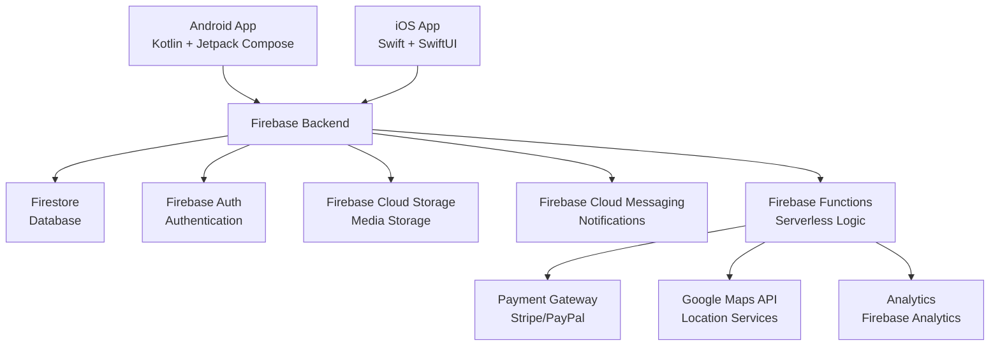

# Mega Market App Architecture Design

## Core Features

The Mega Market app will include the following core features, designed to provide a seamless shopping experience similar to the Marjane supermarket app:

1. **User Authentication**
   - User registration and login
   - Password reset functionality
   - Secure user sessions
   - Optional: Social media login (Google, Facebook)

2. **Product Catalog**
   - Display of product information including name, description, price, and photos
   - Organization by categories (e.g., groceries, household, electronics)
   - Product details view with multiple images and specifications

3. **Categories**
   - Hierarchical category structure for easy navigation
   - Category browsing with subcategories

4. **Search Functionality**
   - Search products by name, brand, or keywords
   - Filter by category, price range, or availability
   - Search suggestions and auto-complete

5. **Shopping Cart**
   - Add/remove products from cart
   - Update product quantities
   - Calculate subtotal, taxes, and total cost
   - Persistent cart across sessions

6. **Checkout Process**
   - User address management
   - Payment method selection (credit card, digital wallets)
   - Order summary and confirmation
   - Integration with payment gateways

7. **Order History**
   - View list of past orders
   - Order details including items, status, and tracking
   - Reorder functionality

Additional features to enhance user experience:
- User profile management
- Wishlist/favorites
- Push notifications for order updates
- In-app messaging for customer support
## Technology Choices

### Mobile Apps
- **Android**: Kotlin programming language with Android Jetpack components
  - UI Framework: Jetpack Compose for declarative UI
  - Architecture: MVVM pattern with ViewModels and LiveData/Flow
- **iOS**: Swift programming language with SwiftUI
  - UI Framework: SwiftUI for cross-platform consistency
  - Architecture: MVVM pattern with Combine framework

### Backend and Database
- **Database**: Firebase Firestore (NoSQL cloud database)
  - Real-time data synchronization
  - Scalable and easy to manage
- **Authentication**: Firebase Authentication
  - Email/password authentication
  - Social login providers
- **Storage**: Firebase Cloud Storage for product images
- **Notifications**: Firebase Cloud Messaging (FCM)
- **Serverless Functions**: Firebase Cloud Functions (optional for complex business logic)

### Additional Technologies
- **Payment Processing**: Integration with payment gateways like Stripe or PayPal
- **Maps and Location**: Google Maps SDK for delivery address selection
- **Analytics**: Firebase Analytics for user behavior tracking
- **Version Control**: Git with GitHub for code management
- **CI/CD**: GitHub Actions or Firebase App Distribution for automated testing and deployment
## High-Level System Architecture

The Mega Market app follows a client-server architecture with Firebase as the backend-as-a-service (BaaS) platform. This design ensures scalability, real-time capabilities, and reduced development time for backend services.

### Architecture Overview
- **Client Layer**: Native Android and iOS applications
- **Backend Layer**: Firebase services (Firestore, Auth, Storage, Functions)
- **External Services**: Payment gateways, mapping services, analytics

### Data Flow
1. Users interact with the mobile app UI
2. App communicates with Firebase services via SDKs
3. Data is stored/retrieved from Firestore
4. Real-time updates are pushed to clients
5. Serverless functions handle complex operations (e.g., order processing)
6. External APIs are called for payments and location services

### Key Components
- **Mobile Apps**: Handle UI, user interactions, and local data caching
- **Firebase Firestore**: NoSQL database for products, users, orders
- **Firebase Auth**: Manages user authentication and authorization
- **Firebase Storage**: Stores product images and user-uploaded content
- **Firebase Functions**: Executes server-side logic for checkout, notifications
- **Third-Party Integrations**: Payment processing, geolocation, push notifications

### Security Considerations
- Firebase Auth handles user authentication
- Firestore security rules enforce data access permissions
- HTTPS for all communications
- Data encryption at rest and in transit

### Scalability
- Firebase auto-scales based on usage
- Global CDN for fast content delivery
- Real-time database for instant UI updates
## Firebase Database Schema

The database schema is designed using Firebase Firestore, a NoSQL document database. Data is organized into collections and documents for flexibility and scalability.

### Collections and Documents

#### Users Collection
- **Document ID**: Auto-generated user ID from Firebase Auth
- **Fields**:
  - `email`: String (user's email address)
  - `displayName`: String (user's full name)
  - `phoneNumber`: String (optional)
  - `addresses`: Array of objects (delivery addresses)
    - Each address: {street: String, city: String, state: String, zipCode: String, country: String}
  - `createdAt`: Timestamp
  - `updatedAt`: Timestamp

#### Products Collection
- **Document ID**: Auto-generated product ID
- **Fields**:
  - `name`: String (product name)
  - `description`: String (detailed description)
  - `price`: Number (current price)
  - `originalPrice`: Number (optional, for discounts)
  - `images`: Array of Strings (Firebase Storage URLs)
  - `categoryId`: String (reference to category document)
  - `brand`: String (product brand)
  - `stockQuantity`: Number (available stock)
  - `isActive`: Boolean (product availability)
  - `tags`: Array of Strings (for search)
  - `createdAt`: Timestamp
  - `updatedAt`: Timestamp

#### Categories Collection
- **Document ID**: Auto-generated category ID
- **Fields**:
  - `name`: String (category name)
  - `description`: String (optional)
  - `parentId`: String (optional, for subcategories)
  - `image`: String (category image URL)
  - `isActive`: Boolean
  - `createdAt`: Timestamp

#### Orders Collection
- **Document ID**: Auto-generated order ID
- **Fields**:
  - `userId`: String (reference to user document)
  - `items`: Array of objects (ordered items)
    - Each item: {productId: String, name: String, price: Number, quantity: Number}
  - `subtotal`: Number
  - `tax`: Number
  - `shippingCost`: Number
  - `total`: Number
  - `status`: String (pending, confirmed, processing, shipped, delivered, cancelled)
  - `shippingAddress`: Object (selected delivery address)
  - `paymentMethod`: String
  - `paymentStatus`: String (pending, completed, failed)
  - `createdAt`: Timestamp
  - `updatedAt`: Timestamp

#### Carts Subcollection (under Users)
- **Document ID**: Product ID
- **Fields**:
  - `quantity`: Number (quantity in cart)
  - `addedAt`: Timestamp

### Additional Considerations
- Use Firestore security rules to control read/write access
- Implement data validation at the application level
- Use subcollections for related data (e.g., order items could be a subcollection, but flattened for simplicity)
- Indexes should be created for frequently queried fields (e.g., categoryId, userId)
## Architecture Diagram

